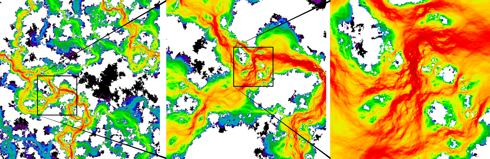

# Finite-Difference Reynolds Fluid Solver

## Description

An efficient python code to solve diffusion equation on a Cartesian grid:
<!-- $$
\begin{aligned}
&\nabla\cdot\left(g^3 \nabla p\right) = 0,\\
&p(x=0) = 1, \quad p(x=1) = 0,\\ 
&p(y=0) = p(y=1), \quad 
\left.\frac{\partial p}{\partial y}\right|_{y=0} =
\left.\frac{\partial p}{\partial y}\right|_{y=1}
\end{aligned}
$$ -->


## What can it do?

+ It takes as input a gap field $g$.
+ It analyzes its connectivity and removes isolated islands and checks for percolation (whether a flow problem can be solved).
+ It dilates non-zero gap field to properly handle impenetrability of channels, it allows not to erode the domain for flux calculation.
+ It applies an inlet pressure $p_i=1$  on one side $x=0$ and an outlet pressure $p_0=0$ on the opposite side $x=1$ and uses periodic boundary conditions on the lateral sides $y=\{0,1\}$.
+ It constructs a sparse matrix with conductivity proportional to $g^3$.
+ The linear system of equations is solved by a direct (`pardiso_spsolve`) or an iterative solver (CG with AMG preconditioner).
+ Total flux is properly computed.

## Usage

1. Clone files
```bash 
git clone git@github.com:vyastreb/FDTransportCode.git
```
2. Install required packages
```bash
pip install -r requirements.txt
```
or with conda
```bash
conda install --file requirements.txt
```
3. Run a minimal test (incompressible potential flow around a circular inclusion)
```python
import numpy as np
import Transport_code_accelerated as FS
import matplotlib.pyplot as plt

n = 100
X, Y = np.meshgrid(np.linspace(0, 1, n), np.linspace(0, 1, n))
gaps = (np.sqrt((X - 0.5)**2 + (Y - 0.5)**2) > 0.2).astype(float)

_, _, flux = FS.solve_fluid_problem(gaps, "auto")
if flux is not None: plt.imshow(np.sqrt(flux[:,:,0]**2 + flux[:,:,1]**2), origin='lower', cmap='jet'); plt.show()
```
4. Try a more advanced tests `Evolution_test.py` and `Solution_test.py`.

## Available Solvers and Preconditioners

The fluid flow solver supports several linear system solvers and preconditioners for efficient and robust solution of large sparse systems:

**Direct Solvers:**
- 🥇**Cholesky (`cholesky`)**: Uses CHOLMOD via scikit-sparse. Fastest for moderate system sizes if enough memory is available.
- **PARDISO (`pardiso`)**: Intel MKL PARDISO direct solver, efficient for large symmetric systems (memory optimized low-level parameters are used).
- **SciPy LU (`scipy.spsolve`)**: Standard LU decomposition from SciPy (not recommended for large problems: too slow and consumes a lot of memory).

**Iterative Solvers:**
- 🏆 **PETSc CG with HYPRE Preconditioner (`petsc`)**: Uses PETSc's CG solver with HYPRE preconditioning for high performance and scalability - this is the fastest solver.
- **Conjugate Gradient with AMG Preconditioner (`scipy.amg.rs`, `scipy.amg.sa`, `scipy`)**: Uses PyAMG's Ruge-Stuben or Smoothed Aggregation algebraic multigrid as a preconditioner for the conjugate gradient method - 🥈 **`scipy.amg.rs`** is one of the best in terms of performance choices, the most memory efficient.

**Rules of thumb:** If `auto` is specified, `cholesky` solver is used. For memory-limited cases, use `scipy.amg.rs`. For speed, use `petsc`.


## Performance

Performance of the code on a truncated rough surface is shown below. The peak memory consumption and the CPU time required to perform connectivity analysis, constructing the matrix and solving the linear system are provided. The real number of DOFs is reported which corresponds to approximately 84% of the square grid $N\times N$ for $N\in\{500,1\,000,2\,000,4\,000,6\,000,8\,000\}$.


## Illustration

An example of a fluid flow simulation, solved on the grid $n\times n = 8\,000 \times 8\,000$ which features a truncated self-affine rough surface with a rich spectrum. Solution time on my laptop with `petsc` is only 97 seconds and the peak memory consumption is 25.8 GB.



## Info

+ Author: Vladislav A. Yastrebov (CNRS, Mines Paris - PSL)
+ AI usage: Cursor (different models), ChatGPT 4o, 5, Claude Sonnet 3.7, 4
+ License: BSD 3-clause
+ Date: Sept 2025


