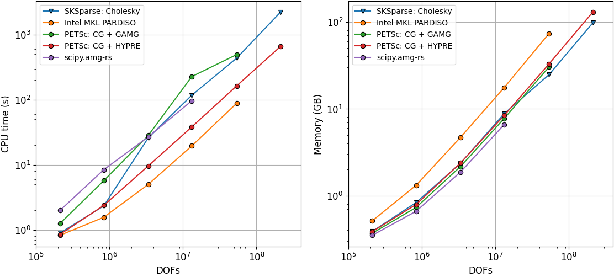

# Finite-Difference Reynolds Fluid Solver

## Description

An efficient python code to solve diffusion equation on a Cartesian grid:
<!-- $$
\begin{aligned}
&\nabla\cdot\left(g^3 \nabla p\right) = 0,\\
&p(x=0) = 1, \quad p(x=1) = 0,\\ 
&p(y=0) = p(y=1), \quad 
\left.\frac{\partial p}{\partial y}\right|_{y=0} =
\left.\frac{\partial p}{\partial y}\right|_{y=1}
\end{aligned}
$$ -->


## What can it do?

+ It takes as input a gap field $g$.
+ It analyzes its connectivity and removes isolated islands and checks for percolation (whether a flow problem can be solved).
+ It dilates non-zero gap field to properly handle impenetrability of channels, it allows not to erode the domain for flux calculation.
+ It applies an inlet pressure $p_i=1$  on one side $x=0$ and an outlet pressure $p_0=0$ on the opposite side $x=1$ and uses periodic boundary conditions on the lateral sides $y=\{0,1\}$.
+ It constructs a sparse matrix with conductivity proportional to $g^3$.
+ Different solvers (direct and iterative with appropriate preconditioners) are selected and tuned to solve efficiently the resulting linear system of equations.
+ Total flux is properly computed.

## Usage

1. Clone the repository
```bash 
git clone git@github.com:vyastreb/FDTransportCode.git
cd FDTransportCode
```
2. Install the package and its dependencies
```bash
pip install -e .
pip install -r requirements.txt
```
or with conda
```bash
conda install --file requirements.txt
```
3. Run a minimal test (incompressible potential flow around a circular inclusion)
```python
import numpy as np
from fluxflow import transport as FS
import matplotlib.pyplot as plt

n = 100
X, Y = np.meshgrid(np.linspace(0, 1, n), np.linspace(0, 1, n))
gaps = (np.sqrt((X - 0.5)**2 + (Y - 0.5)**2) > 0.2).astype(float)

_, _, flux = FS.solve_fluid_problem(gaps, solver="auto")
if flux is not None:
    plt.imshow(np.sqrt(flux[:, :, 0]**2 + flux[:, :, 1]**2),
               origin='lower', cmap='jet')
    plt.show()
```
4. Run the test suit
```bash
python -m pytest -q
```
5. Or run these tests manually `/tests/test_evolution.py`, `/tests/test_solve.py` and `/tests/test_solvers.py`.

## Available Solvers and Preconditioners

The fluid flow solver supports several linear system solvers and preconditioners for efficient and robust solution of large sparse systems:

| Solver String | Solver Type | Preconditioner | Backend | Description |
|---------------|-------------|----------------|---------|-------------|
| `cholesky` | Direct | - | scikit-sparse | 🏆 CHOLMOD Cholesky decomposition. Fastest and most memory efficient. |
| `pardiso` | Direct | - | Intel MKL | PARDISO direct solver. Suboptimal in memory and speed. |
| `scipy` | Iterative (CG) | AMG (Ruge-Stuben) | SciPy/PyAMG | Conjugate Gradient with default AMG preconditioner. |
| `scipy.amg-rs` | Iterative (CG) | AMG (Ruge-Stuben) | SciPy/PyAMG | CG with Ruge-Stuben AMG. Explodes in time for large problems. |
| `scipy.amg-smooth_aggregation` | Iterative (CG) | AMG (Smoothed Aggregation) | SciPy/PyAMG | CG with Smoothed Aggregation AMG. |
| `petsc-cg.gamg` | Iterative (CG) | GAMG | PETSc | CG with Geometric Algebraic Multigrid. |
| `petsc-cg.hypre` | Iterative (CG) | HYPRE | PETSc | 🥇 CG with HYPRE BoomerAMG. Excellent memory efficiency. |
| `petsc-cg.ilu` | Iterative (CG) | ILU | PETSc | CG with Incomplete LU factorization. |
| `petsc-mumps` | Direct | - | PETSc/MUMPS | MUMPS direct solver via PETSc. |
| `auto` | - | - | - | Automatically selects `cholesky` with `petsc` as fallback. |

**Rules of thumb:** 
- For fastest computation: use `cholesky` (default when `auto` is specified)
- For best memory efficiency: use `cholesky` or `petsc-cg.hypre`
- For large-scale problems: prefer `petsc-cg.hypre` for scalability
- Avoid `scipy.amg-rs` for problems with N > 2000


## Performance

Performance of the code on a truncated rough surface is shown below. The peak memory consumption and the CPU time required to perform connectivity analysis, constructing the matrix and solving the linear system are provided. The real number of DOFs is reported which corresponds to approximately 84% of the square grid $N\times N$ for $N\in\{500,1\,000,2\,000,4\,000,6\,000,8\,000,16\,000\}$.




## Illustration

An example of a fluid flow simulation, solved on the grid $n\times n = 8\,000 \times 8\,000$ which features a truncated self-affine rough surface with a rich spectrum. Solution time on my laptop with `petsc` is only 97 seconds and the peak memory consumption is 25.8 GB.


## Info

+ Author: Vladislav A. Yastrebov (CNRS, Mines Paris - PSL)
+ AI usage: Cursor (different models), ChatGPT 4o, 5, Claude Sonnet 3.7, 4, 4.5
+ License: BSD 3-clause
+ Date: Sept-Oct 2025


